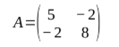
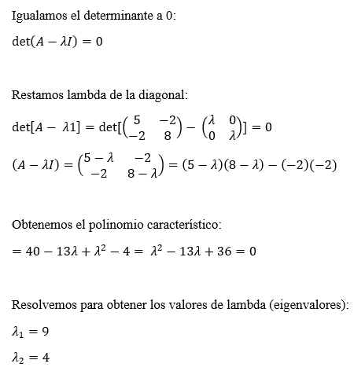

# Práctica 8. Cálculo de eigenvalores con el método QR

## Integrantes
- Alba Pérez Paulina
- Galeana Morán Miguel Ángel
- Herrera Barrera Joyce

## Uso e instalación

-No se necesita instalar librerías externas.

-Se necesita abrir la terminal y correr: python main.py

## Ejercicio 1. Cálculos Con el Polinomio Característico

Por medio del método del polinomio característico, calcular los eigenvalores de la siguiente matriz.

## Ejercicio 2. El Método QR Simple

Programar el método Q R para calcular los eigenvalores de una matriz real A de tamaño n×n. Comenzar suponiendo que la matriz A es simétrica.

## Ejercicio 3. El Método QR

Agregar una restricción que asegure que se alcance la precisión deseada. En este caso pedir que los valores fuera de la diagonal de la matriz $A_k$ sean todos más chicos que un $ε$ dado.
Teniendo eso en mente, programar una función para el método Q R que reciba como
parámetros una matriz real A que sea cuadrada y simétrica, $ε$ y un número máximo de
iteraciones N en caso de que no se alcance la precisión deseada , el valor de la precisión
deseada. El método deberá regresar la matriz $A_k$ una vez que esta tenga valores fuera de la
diaognal menores que $ε$ o que se haya alcanzado el número máximo de iteraciones.
Una vez programada la función, prueba con la
matriz A del ejercicio 1, con tolerancia $ε=1×10^{−10}$ y número máximo de iteraciones
1000; extraer los valores de la diagonal de la matriz resultante y comparar con los
eigenvalores calculados en el Ejercicio 1.

## Conclusión

Esta práctica nos ayudó a ver el uso del código QR de forma más completa y terminar de comparar con el método anterior LU, donde en este caso, puede generalizarse a matrices cuadradas simétricas más grandes. 

Nos es útil para aprender a reutilizar código de prácticas pasadas con mayor naturalidad y entender el cambio de comportamiento cuando lo probamos en distintos casos.